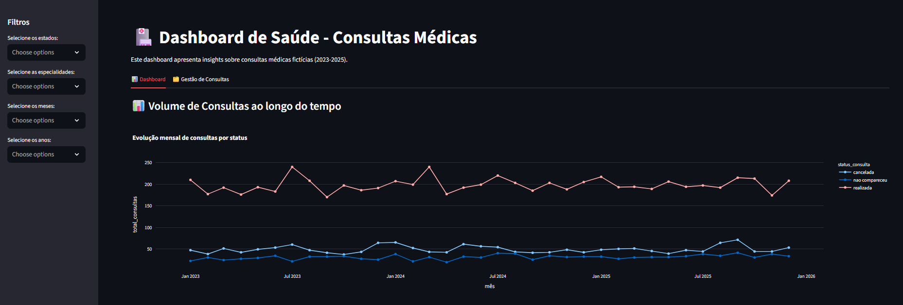
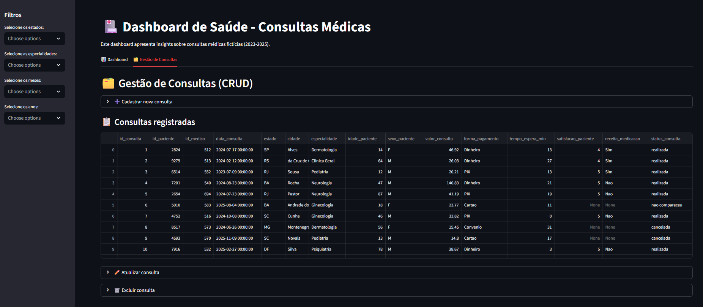

# 🏥 Dashboard de Saúde - Consultas Médicas

Este projeto é um **dashboard interativo** desenvolvido com **Streamlit, Pandas e Plotly Express** para análise de um dataset fictício de consultas médicas (2023-2025).

O objetivo é explorar dados de saúde de forma **visual e intuitiva**, permitindo identificar padrões de consultas, receitas médicas, satisfação de pacientes e outras métricas importantes.

---

## 🚀 Funcionalidades

### 📊 **Dashboard (Aba 1)**
- **Filtros dinâmicos** por estado, especialidade, mês e ano.
- **Visualizações interativas** com Plotly:
  - Evolução mensal de consultas por status.
  - Distribuição de especialidades médicas.
  - Receita total e Top 5 especialidades por faturamento.
  - Análise geográfica por estado.
  - Perfil de pacientes (idade, sexo).
  - Tempo de espera (boxplots).
  - Correlação entre tempo de espera e satisfação.
  - Satisfação média por especialidade, sexo e estado.
  - Prescrição de medicação por especialidade e região.

### 🗂️ **Gestão de Consultas (Aba 2)**
- **Cadastrar** nova consulta com formulário interativo.
- **Visualizar** tabela com todas as consultas armazenadas.
- **Atualizar** registros existentes (formulário pré-preenchido).
- **Excluir** consultas com confirmação.
- Dados sempre sincronizados com o banco de dados.

## 📷 Imagens de Exemplo (Aba 1 e Aba 2)

Aqui estão algumas capturas de tela que mostram a Aba 1 e Aba 2 do projeto

### 📊 Dashboard


### 🗂️ Gestão de Consultas (CRUD)


---
## 🛠️ Arquitetura do Projeto

O projeto está organizado em módulos para facilitar manutenção e escalabilidade:

📂 src/
├── 📄 app.py # 🎨 Interface principal (Streamlit) → Dashboard + CRUD
├── ⚙️ crud.py # 🔄 Operações de banco (listar, inserir, atualizar, excluir, importar CSV inicial)
├── 🗄️ database.py # 🛢️ Conexão e criação da tabela SQLite
├── 📂 data/
│ └── 📑 dataset_saude.csv # 📥 Base inicial de dados (importada no 1º uso)
├── 📂 img/ # 🖼️ Prints da aplicação
└── 🗃️ consultas.db # 📌 Banco de dados SQLite (gerado automaticamente)

## 💾 Fluxo de Dados

1. **Importação inicial**  
   - No primeiro uso, o sistema lê o arquivo `dataset_saude.csv` e popula o banco SQLite (`consultas.db`).

2. **Persistência**  
   - A partir daí, todas as operações (cadastro, atualização, exclusão) são feitas no banco de dados.
   - O CSV não é mais alterado, servindo apenas como fonte inicial.

3. **Visualização**  
   - O dashboard sempre lê os dados diretamente do banco, garantindo consistência entre CRUD e gráficos.


## ⚙️ Tecnologias Utilizadas

* [Python](https://www.python.org/)
* [Pandas](https://pandas.pydata.org/)
* [Plotly Express](https://plotly.com/python/plotly-express/)
* [Streamlit](https://streamlit.io/)
* [SQLite3](https://www.sqlite.org/)
---
## 🚀 Como Rodar o Projeto

### 1️⃣ Opção 1:

#### 🏠 Rodar localmente:

1. Clone este repositório:

   ```bash
   git clone [https://github.com/seu-usuario/dashboard_saude.git](https://github.com/seu-usuario/dashboard_saude.git)
   
2. Entre no repositório

  ``` bash
  cd dashboard_saude
  ````

3. Crie e ative um ambiente virtual (opcional, mas recomendado):

   ```bash
   python -m venv venv
   source venv/bin/activate   # Linux/Mac
   venv\Scripts\activate      # Windows

4. Instale as dependências:

   ```bash

   pip install -r requirements.txt

5. Execute o dashboard:

   ```bash
   streamlit run app.py

6. O dashboard abrirá automaticamente no navegador 

  ``` bash
[http://localhost:8501](http://localhost:8501)
  
  ```
### 2️⃣ Opção 2:

#### ☁️ Deploy no Streamlit Cloud

1. Suba este projeto para um repositório no **GitHub**.  
2. Acesse o [Streamlit Cloud](https://streamlit.io/cloud).  
3. Conecte sua conta GitHub e selecione este repositório.  
4. Configure o comando de execução:

   ```bash
   streamlit run src/app.py

## ✨ Autora

Projeto desenvolvido por **Francielli Valerio** 👩🏿‍💻  
- [LinkedIn](https://www.linkedin.com/in/franciellivalerio/)  
- [X (Twitter)](https://x.com/httpsfranverse)
